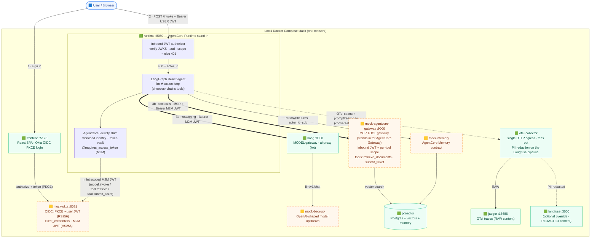

# agentcore-dual-gateway-poc

> A runnable reference implementation of the dual-gateway agentic AI pattern: a LangGraph
> ReAct agent on an AgentCore Runtime stand-in, **separate model and tool gateways**, per-tool
> OAuth 2.0 scoping, OIDC PKCE user auth, and end-to-end OpenTelemetry observability.

[](https://github.com/inetgas/agentcore-dual-gateway-poc/actions/workflows/main.yml)


Companion code to the LinkedIn article **[Building a Production-Grade Agentic AI Platform on AWS
Bedrock AgentCore](https://www.linkedin.com/pulse/building-production-grade-agentic-ai-platform-aws-bedrock-wang-zjwec/)**.
The article explains the *why* (and describes the real production platform); this repo is a local,
runnable *how*.

> **What's faithful vs. swapped.** The blog describes a production system on real AWS services.
> This POC keeps the same **structure and contracts** but runs entirely on your laptop with
> **local stand-ins** for the cloud-only pieces: a mock OIDC provider for the enterprise IdP,
> OSS Kong for the enterprise AI gateway, a local MCP gateway for AWS AgentCore Gateway, a mock
> Bedrock upstream, a mock AgentCore Memory, and Jaeger + Langfuse for the production
> observability stack.
>
> Several of these (Okta, Bedrock, AgentCore Memory, AgentCore Identity/Gateway/Runtime) are
> **managed AWS/SaaS services with no self-hostable or Docker image** — there's nothing to run
> offline, so the POC mocks their *contract* (e.g. `mock-memory` implements AgentCore Memory's
> `create_event` / `list_events` over Postgres). Each stand-in swaps for the real service by env
> — see [Fork this for your environment](#fork-this-for-your-environment).

> **Demo credentials only.** Passwords, secrets, API keys, and tokens in the compose files are
> fixed local demo values for an offline POC. They are not production credentials and must be
> replaced before adapting this pattern to a real environment.

---

## What this is

A self-contained stack (`docker compose up`) that demonstrates the four design decisions the blog calls
load-bearing — and proves them with a **15/15 test suite** and end-to-end traces:

- **Dual-gateway perimeter** — a **model gateway** (Kong) and a **tool gateway** (a local
  AgentCore Gateway over MCP), each with its own identity primitive, policy, and audit stream.
- **Per-tool identity scoping** — `@requires_access_token` exchanges the agent's M2M
  credentials for a **per-tool** scoped JWT; the user's PKCE token is *never* forwarded to a
  tool. The tool gateway enforces the per-tool scope on every call.
- **User auth via PKCE** — Authorization Code + PKCE against an OIDC provider; the user's
  identity becomes audit context (`sub` → memory `actor_id`) but never the tool authorization.
- **`conversation_id` as the join key** — carried as OpenTelemetry baggage through every span,
  joining the model hop and both tool hops across Jaeger and Langfuse.

## What this isn't

- **Not production-hardened.** No PII redaction (that's an enterprise-Kong plugin — see
  out-of-scope), no eval harness, no circuit breakers, no multi-tenant isolation.
- **Not AWS-locked.** The cloud-only services are mocked locally; each is swappable by env.
- **Not a tutorial.** The companion blog post is the explanation; this is the reference code. The
  deep operational detail lives in [`docs/`](./docs/INDEX.md).

## The four design decisions → where they live

| Decision (blog section) | Look at |
|---|---|
| Dual gateway — *Design decision 1* | `docker-compose.yml` (two services), `services/kong/kong.yaml` (model gateway), `services/mock-agentcore-gateway/server.py` (MCP tool gateway) |
| Per-tool scoping — *Design decision 2* | `services/runtime/gateway.py` (`@requires_access_token`, scopes `tool.retrieve` / `tool.submit_ticket`), `services/runtime/identity.py` (workload identity + token vault), `services/mock-agentcore-gateway/server.py` (per-tool scope enforced on each `tools/call`) |
| PKCE user auth — *Architecture* | `services/mock-okta/app.py` (OIDC), `frontend/` (real PKCE), `services/runtime/authorizer.py` (inbound JWT authorizer) |
| `conversation_id` baggage — *Design decision 3* | `services/runtime/app.py` (baggage set per request), `services/runtime/otel_setup.py` (BaggageSpanProcessor → every span) |

## Architecture



**Two gateways, by role.** The agent's **model** call (reasoning) goes through **Kong**
(`ai-proxy` → mock-bedrock). The agent's **tool** calls go through the **AgentCore Gateway**
stand-in as **MCP** tools — it validates the inbound JWT and enforces the per-tool scope
(`tool.retrieve` / `tool.submit_ticket`) before running each tool. Full rationale and the
target AWS multi-account diagram are in [`docs/ARCHITECTURE.md`](./docs/ARCHITECTURE.md).

## Quick start

```bash
cd agentcore-dual-gateway-poc
docker compose up --build          # Jaeger-only (lightweight). For Langfuse too, see Observability.
```

> Prefer the **Makefile** for a foolproof path: `make up` (lightweight) · `make obs`
> (with Langfuse) · `make test` (15/15) · `make token` (mint a demo JWT) · `make down`.
> The Collector runs one always-on config, so mixing these can't misconfigure tracing.

Then either use the **chat UI** or drive it **headless**:

```bash
# UI:  open http://localhost:5173  →  Sign in with Okta  →  pick Alice or Bob  →  chat
#      (PKCE uses Web Crypto, which needs a secure context — localhost qualifies)

# Headless: mint a user token from the mock IdP, then call the runtime
TOKEN=$(curl -s -X POST http://localhost:8081/test/mint \
  -H 'content-type: application/json' \
  -d '{"sub":"alice@example.com","name":"Alice","aud":"mvp-runtime","scope":"openid profile","sign":"good"}' \
  | python3 -c 'import sys,json;print(json.load(sys.stdin)["access_token"])')

curl -s -X POST http://localhost:8080/invoke \
  -H "Authorization: Bearer $TOKEN" -H 'content-type: application/json' \
  -d '{"conversation_id":"demo-001","message":"Please open a ticket for DL-Reader access on prod"}'
```

You'll see the LangGraph ReAct loop **chain two tools in one turn**: `retrieve_documents`
(grounding) → reason → `submit_ticket` — each authorized by a **separate, narrowly-scoped JWT**
the tool gateway validates. The runtime also exposes `GET /workload-identity` (the auto-created
identity + its token-vault retrievals) and `GET /graph` (proof the orchestrator is a real
LangGraph `llm ⇄ action` graph).

### Observability

The runtime emits OTLP (spans **plus the prompt/response content**) to a single
**OTel Collector**, which fans out: raw to **Jaeger** (`http://localhost:16686`, always
bundled — search service `mvp-orchestrator`). Add the override to also start **Langfuse**;
the Collector then forwards a **PII-redacted** copy to it (Decision 4 — redact at the
Collector, Pattern B):

```bash
docker compose -f docker-compose.yml -f docker-compose.langfuse.yml up --build
#   Langfuse http://localhost:3000  (login demo@example.com / demodemo123)
```

A multi-step turn shows the loop — `orchestrator.invoke → inbound_authorizer → entry_node →
(llm → action)×2 → llm → response_node` — with `conversation_id` on every span, `gen_ai.*` on
each `llm` (model via Kong), and `via=agentcore-gateway` + `mcp.*` + `auth.scope` on each
`action` (tools via the gateway). **Jaeger shows the raw prompt/response; Langfuse shows it
with PII (emails, SSNs, …) stripped by the Collector.** Annotated screenshots:
[`docs/OBSERVABILITY.md`](./docs/OBSERVABILITY.md).

### Proof suite (15/15)

```bash
docker compose --profile test run --rm tests
```

10 tests cover the inbound chain + workload identity (PKCE → user JWT; authorizer 401s for
no-token / bad-sig / wrong-aud / expired; `sub` → `actor_id` isolation; workload identity
created + used). 5 cover the ReAct agent (real LangGraph graph; single retrieve; **multi-step
retrieve→submit_ticket**; clarify on a vague turn; tool calls traverse the gateway with the
correct per-tool scope).

## Project structure

```
agentcore-dual-gateway-poc/
├── Makefile                          # safe wrappers: make up / obs / test / token / down
├── docker-compose.yml                # the whole stack (one command)
├── docker-compose.langfuse.yml       # optional override: starts the Langfuse containers (the Collector already forwards a redacted copy)
├── frontend/                         # React SPA — Okta OIDC Authorization Code + PKCE login
├── services/
│   ├── mock-okta/                    # OIDC provider stand-in: PKCE→RS256 user JWT + JWKS; client_credentials→HS256 M2M
│   ├── runtime/                      # AgentCore Runtime stand-in (ASGI app):
│   │                                 #   authorizer.py (inbound JWT authorizer), app.py (entrypoint + OTel baggage),
│   │                                 #   agent.py (LangGraph ReAct graph), model.py (tool-calling model),
│   │                                 #   tools.py (tool clients → gateway), gateway.py (Kong model + AgentCore Gateway MCP),
│   │                                 #   identity.py (workload identity + token vault), memory_client.py, otel_setup.py
│   ├── mock-agentcore-gateway/       # MCP tool gateway stand-in: inbound JWT + per-tool scope; tools over pgvector
│   ├── mock-bedrock/                 # OpenAI-shaped model upstream (behind Kong)
│   ├── mock-memory/                  # AgentCore Memory contract (Postgres-backed)
│   ├── otel-collector/               # config.yaml — single always-on config: Jaeger raw + Langfuse PII-redacted
│   └── kong/kong.yaml                # real Kong 3.14 — MODEL gateway only (ai-proxy)
├── corpus/                           # sample RAG corpus
├── tests/                            # proof suite (15/15)
└── docs/                             # INDEX, ARCHITECTURE, RUNBOOK, OBSERVABILITY, diagrams, screenshots
```

## Fork this for your environment

Each local stand-in maps to a production component; the agent code and the contracts don't
change. (Full step-by-step in [`docs/RUNBOOK.md`](./docs/RUNBOOK.md).)

| Local (this POC) | Production |
|---|---|
| `mock-okta` | Real OIDC IdP — Okta / Entra ID / Auth0 / Ping / Cognito (RS256 + JWKS) |
| `kong` (OSS `ai-proxy`) — model gateway | Kong + Konnect Enterprise (`openid-connect`, `ai-proxy-advanced`, `ai-sanitizer` for PII) — or your enterprise AI gateway |
| `mock-agentcore-gateway` (MCP) — tool gateway | **AWS AgentCore Gateway** (managed MCP gateway; inbound OAuth + fine-grained per-tool authz) |
| `runtime` (ASGI stand-in) + `identity.py` | AWS **AgentCore Runtime** + **AgentCore Identity** (real `@requires_access_token`) |
| `mock-memory` (contract mock over Postgres) | AWS **AgentCore Memory** (managed; no local/Docker build) |
| `mock-bedrock` | Amazon **Bedrock** (Claude reasoning, Titan embeddings) |
| `pgvector` container | **RDS Postgres + pgvector** |
| Jaeger + Langfuse | Datadog / Grafana + Langfuse, via an OTel Collector |

## What's intentionally not in scope

These appear in the blog (the production platform) but are deliberately out of this POC:

- **PII redaction on the *model* gateway** — Kong's `ai-sanitizer` is Enterprise-only; the OSS
  `ai-proxy` passes prompts to the model verbatim. (PII redaction on the *observability* path
  **is** demonstrated — at the OTel Collector; see Decision 4 / Observability above.)
- **RFC 8693 token exchange** — the POC uses a pure M2M grant per tool; the `act`-claim
  user+agent token exchange is a prod refinement.
- **Multi-model routing** (Azure GPT-4o alongside Bedrock), **Datadog/Grafana**, **eval
  harness**, **microVM-per-session isolation**, **GitOps**.


## Related

- **Docs index** — [`docs/INDEX.md`](./docs/INDEX.md) · Architecture [`docs/ARCHITECTURE.md`](./docs/ARCHITECTURE.md) · Runbook [`docs/RUNBOOK.md`](./docs/RUNBOOK.md) · Observability [`docs/OBSERVABILITY.md`](./docs/OBSERVABILITY.md)
- **OAuth 2.0 PKCE** — [RFC 7636](https://datatracker.ietf.org/doc/html/rfc7636) · **Client Credentials** — [RFC 6749 §4.4](https://datatracker.ietf.org/doc/html/rfc6749#section-4.4) · **Token Exchange** — [RFC 8693](https://datatracker.ietf.org/doc/html/rfc8693)
- **OpenTelemetry Baggage** — [W3C Baggage](https://www.w3.org/TR/baggage/) · **AgentCore** — [AWS Bedrock AgentCore docs](https://docs.aws.amazon.com/bedrock-agentcore/) · **MCP** — [spec](https://modelcontextprotocol.io/) · **LangGraph** — [docs](https://langchain-ai.github.io/langgraph/)
- **Tail sampling on the OTel Collector (keep error/slow traces, drop the bulk)** — illustrative
  prod config in [`otel-collector-prod-with-tail-sampling.yaml`](./otel-collector-prod-with-tail-sampling.yaml)

## Notes

- User tokens are **RS256 + JWKS** (production-faithful inbound validation); M2M tokens to Kong
  and the gateway stay HS256 locally (the OSS `jwt` plugin can't fetch JWKS — enterprise
  `openid-connect` does).
- Browser PKCE needs a secure context → use **`localhost:5173`** (not an IP / other host).
- Memory is durable (Postgres) — use a fresh `conversation_id` to see `prior_turns=0`.

## License

MIT. Use it, fork it, ship it.

## Author

Stanley W. Wang — AI architect and practioner. [LinkedIn](https://www.linkedin.com/in/stanleyweiwang/)
