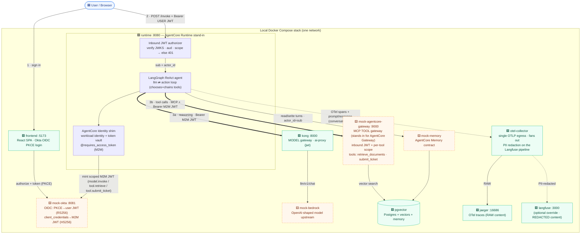
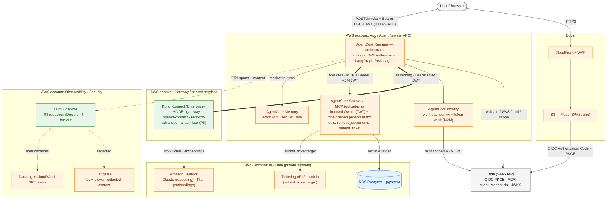
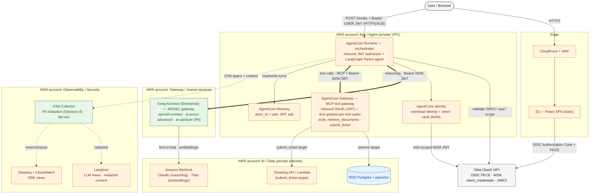

# PoC — Local Deployment Architecture

A map of what runs locally (one `docker compose up`), how a chat request flows through
it, and how each piece maps to real infrastructure. Read this first if you're new.

**Two gateways, by role:**
- **Kong** = the **model gateway** — the agent's reasoning/embedding calls to Bedrock.
- **AgentCore Gateway** = the **MCP tool gateway** — the agent's tool calls
  (`retrieve_documents`, `submit_ticket`) as MCP tools, with inbound JWT validation and
  fine-grained per-tool authorization.

**Legend:** 🟩 real component (same tech as prod) · 🟨 local mock (stands in for a
cloud-only service) · 🟦 client / external. Everything runs as containers on one Docker
network; only a few ports are published to your laptop.

---

## 1. The diagram (local)


<details>
<summary>Diagram source (Mermaid — edit <code>diagrams/local-architecture.mmd</code> and re-render; see <a href="./diagrams/README.md">diagrams/README.md</a>)</summary>


</details>

> **The key idea — two gateways by role.** The agent's **model** call (reasoning) goes
> through **Kong** (`ai-proxy` → Bedrock). The agent's **tool** calls go through
> **AgentCore Gateway** as **MCP** tools: it opens one MCP connection per tool call with a
> **per-tool scoped JWT** (minted by the workload identity), and the Gateway validates the
> token and enforces that tool's scope (`tool.retrieve` / `tool.submit_ticket`) before
> running it. The scoped token never enters agent state/logs/spans.

<details>
<summary>ASCII fallback (for plain-text terminals)</summary>

```
                          🟦 Browser (user)
                            │            │
              1 OIDC PKCE   │            │ 2 POST /invoke  (Bearer USER JWT)
                            ▼            ▼
   ┌──────────── Local Docker network ───────────────────────────────────────────┐
   │  🟩 frontend:5173        🟨 mock-okta:8081 (Okta stand-in)                    │
   │                                                                               │
   │  🟩 runtime:8080  (AgentCore Runtime stand-in)                                │
   │    ├── inbound JWT authorizer  (JWKS/aud/scope → 401)                          │
   │    ├── LangGraph ReAct agent   (llm ⇄ action loop)                             │
   │    └── AgentCore Identity shim (workload identity + token vault)               │
   │          │ model.invoke JWT                 │ tool.* JWT (MCP)                 │
   │          ▼                                  ▼                                  │
   │  🟩 kong:8000 (MODEL gateway)        🟨 mock-agentcore-gateway:9000            │
   │     └─ ai-proxy ─▶ 🟨 mock-bedrock      (MCP TOOL gateway)                     │
   │                                       ├─ inbound JWT + per-tool scope          │
   │                                       ├─ retrieve_documents ─▶ 🟩 pgvector     │
   │                                       └─ submit_ticket                          │
   │  🟩 runtime ─ actor_id=sub ─▶ 🟨 mock-memory ─▶ 🟩 pgvector (Postgres)         │
   │  🟩 runtime ─ OTLP (+content) ─▶ 🟩 otel-collector ─▶ 🟩 jaeger:16686 (RAW)        │
   │                                          └─ PII-redacted ─▶ 🟩 langfuse:3000 (opt) │
   └────────────────────────────────────────────────────────────────────────────────┘
```
</details>

---

## 2. How one chat request flows

**Inbound (user → runtime), proves the auth chain:**
1. The SPA logs the user in via **Okta OIDC Authorization Code + PKCE** → a **user JWT** (RS256).
2. Every `POST /invoke` carries `Authorization: Bearer <user JWT>`. The **inbound authorizer**
   validates it against the (mock) Okta **JWKS / audience / scope** — rejects with **401** otherwise.
3. The user JWT's **`sub` becomes the AgentCore Memory `actor_id`** (per-user isolation).

**Agent loop + outbound:**
4. The **LangGraph ReAct agent** runs an `llm ⇄ action` loop: the model picks a tool, the
   action node runs it, repeat until the model answers. It can **chain** tools in one turn
   (e.g. `retrieve_documents` → `submit_ticket`).
5. For every outbound call the **workload identity** mints a **scoped M2M JWT** from (mock)
   Okta and caches it in the **token vault**; `@requires_access_token` injects it.
6. **Reasoning** goes to **Kong** (`model.invoke`) → `mock-bedrock`. **Tools** go to
   **AgentCore Gateway** over **MCP** with a per-tool token (`tool.retrieve` /
   `tool.submit_ticket`); the Gateway validates the JWT and enforces the tool's scope, then
   runs it (`retrieve_documents` queries **pgvector**; `submit_ticket` creates a ticket).
7. The turn (prompt + final answer) is written to **AgentCore Memory**. **OTel spans —
   including the prompt/response content — go to the OTel Collector**, which fans out: raw
   to **Jaeger**, and (when Langfuse is enabled) **PII-redacted** to **Langfuse** (Decision
   4). Every span is tagged with `conversation_id`.

---

## 3. Containers & ports

| Component | Real/Mock | Published port | Role |
|---|---|---|---|
| `frontend` | 🟩 real | **5173** | React SPA, Okta OIDC PKCE login, sends Bearer on `/invoke` |
| `runtime` | 🟩 real | **8080** | AgentCore Runtime stand-in: inbound authorizer + LangGraph ReAct agent + identity shim |
| `mock-okta` | 🟨 mock | **8081** | Okta stand-in: PKCE user tokens + JWKS; M2M client_credentials |
| `kong` | 🟩 real | (internal 8000) | **Model gateway**: `ai-proxy` (jwt) → mock-bedrock |
| `mock-agentcore-gateway` | 🟨 mock | (internal 9000) | **MCP tool gateway** (stands in for AWS AgentCore Gateway): inbound JWT + per-tool scope; exposes `retrieve_documents` (pgvector) + `submit_ticket` |
| `mock-bedrock` | 🟨 mock | (internal) | Bedrock stand-in (OpenAI-shaped chat/embeddings) |
| `mock-memory` | 🟨 mock | (internal) | AgentCore Memory contract (`create_event`/`list_events`) |
| `pgvector` | 🟩 real | (internal) | Postgres + pgvector (document vectors **and** memory) |
| `otel-collector` | 🟩 real | (internal 4317) | Single OTLP egress; fans out to Jaeger (raw) + Langfuse (**PII-redacted** via a transform processor) |
| `jaeger` | 🟩 real | **16686** | OTel trace UI (raw content) |
| `langfuse` (+ worker, lf-postgres, clickhouse, minio, redis) | 🟩 real | **3000** | Optional LLM-observability (via the langfuse override file) |

AgentCore **Identity** and **Runtime** are not separate containers — they're the
`identity.py` shim and the `runtime` ASGI app. AgentCore **Gateway** *is* its own container
here (`mock-agentcore-gateway`), since it's a distinct service.

---

## 4. Moving this forward to real infrastructure

The contracts are production-faithful, so going live is mostly **swapping each mock for its
cloud service and pointing the gateways at it** — the code paths don't change.

### 4a. Target AWS multi-account architecture (illustrative)



> **Illustrative** — the trust zones / account split shown here are a reasonable target;
> **reconcile with the Scoping Brief and the architecture spec**, whose
> [`mvp-architecture-multi-account.png`](./images/mvp-architecture-multi-account.png) is
> authoritative for the final account topology.

<details>
<summary>Diagram source (Mermaid — <code>diagrams/aws-target-architecture.mmd</code>)</summary>


</details>

### 4b. Component swap map

```
LOCAL (this PoC)                          REAL INFRA (target)
─────────────────────────────────────     ─────────────────────────────────────────────
🟨 mock-okta                          →    Okta tenant (OIDC app + M2M service principal)
🟩 runtime (ASGI stand-in)            →    AWS AgentCore Runtime (managed)
   identity.py shim                   →    AWS AgentCore Identity (workload id + token vault)
   mock-memory                        →    AWS AgentCore Memory
🟨 mock-agentcore-gateway (MCP tools) →    AWS AgentCore Gateway (MCP tool gateway)
🟩 kong (MODEL gateway, OSS plugins)  →    Kong + Konnect, ENTERPRISE license
   ai-proxy                           →      ai-proxy-advanced
   (no PII redaction)                 →      ai-sanitizer (PII scrubbing) on the model routes
🟨 mock-bedrock                       →    Amazon Bedrock (Claude reasoning, Titan embeddings)
🟩 pgvector container                 →    RDS Postgres + pgvector
🟩 otel-collector (redact → Langfuse) →    OTel Collector (redaction processor + tail sampling)
🟩 jaeger (raw) + langfuse (redacted) →    Datadog + Langfuse + CloudWatch (joined by conversation_id)
```

**What changed vs. earlier:** tools are no longer fronted by Kong — they go through
**AgentCore Gateway** (MCP). Kong is now the **model gateway only**, so its `ai-sanitizer`
(PII redaction, Enterprise) covers the **model** hop; the tool path's inbound auth and
fine-grained per-tool authorization are provided by **AgentCore Gateway**. The full
step-by-step path, the Enterprise-Kong license note, and the gotchas are in
[`RUNBOOK.md`](./RUNBOOK.md) (§4 swap map, §5 phased path).
