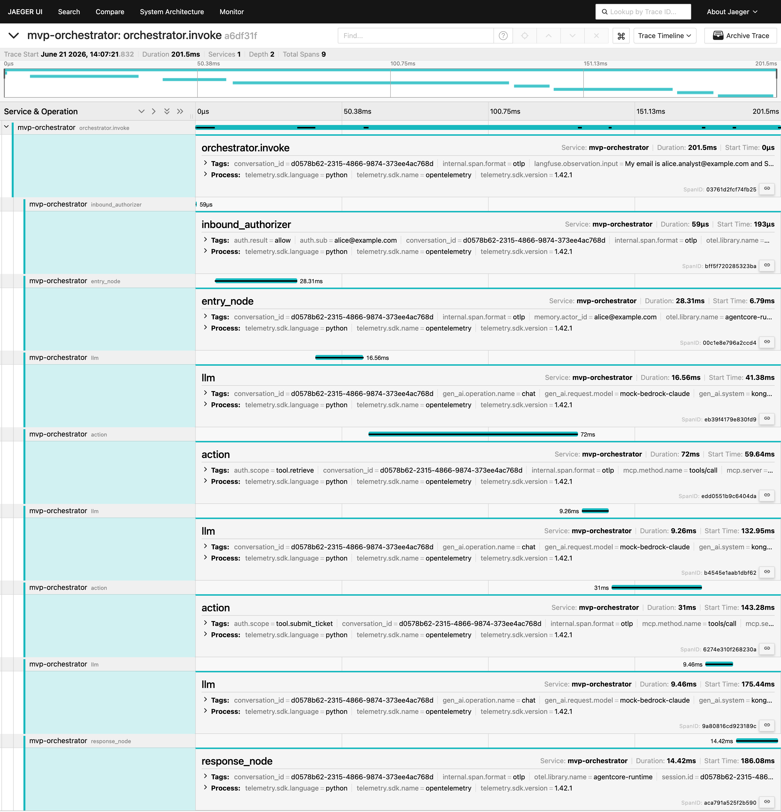
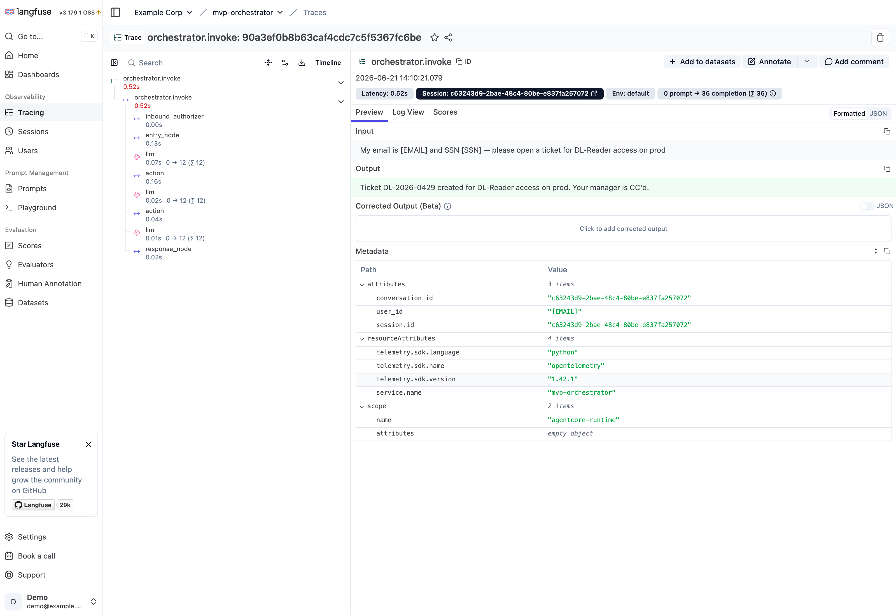
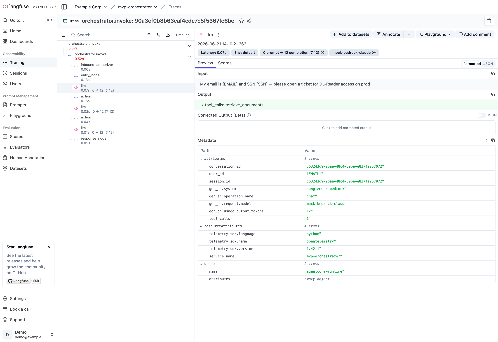
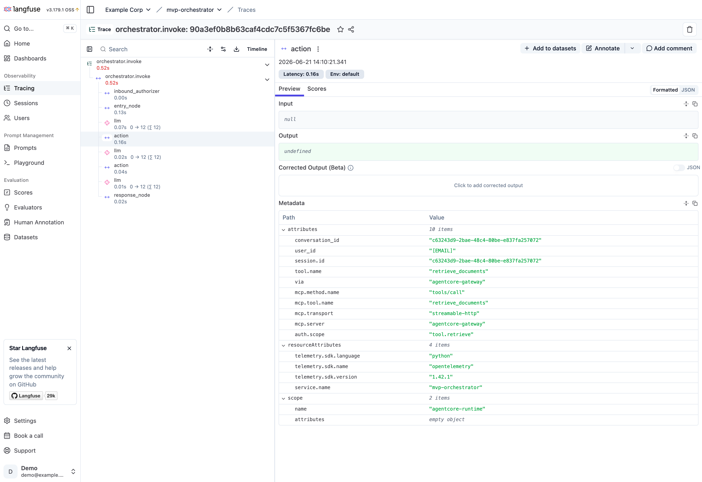
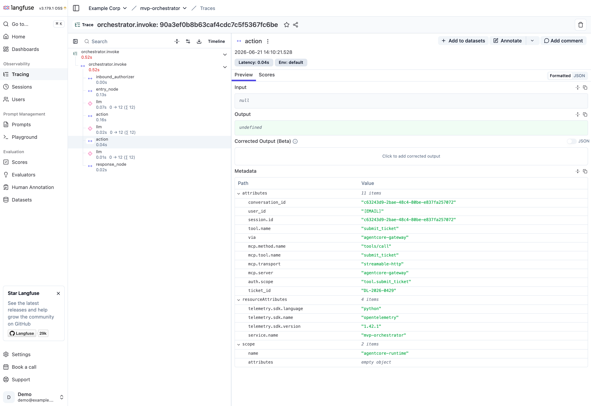

# Observability — end-to-end trace screenshots

Real captures of **one multi-step chat turn** with a **PII-laden prompt** —
*"My email is alice.analyst@example.com and SSN 123-45-6789 — please open a ticket for
DL-Reader access on prod"* — flowing through the PoC, in both **Jaeger** and the bundled
**Langfuse**. The turn drives the LangGraph ReAct loop and shows the gateway split (model
via **Kong**, tools via **AgentCore Gateway** MCP) plus the **Decision 4 two-tier
redaction**: the runtime emits the raw prompt/response to the **OTel Collector**, which fans
out — **Jaeger gets it raw** (in-data-plane) and **Langfuse gets it PII-redacted**.

How to reproduce: `docker compose -f docker-compose.yml -f docker-compose.langfuse.yml up
--build`, send the turn, then open Jaeger (http://localhost:16686) / Langfuse
(http://localhost:3000, `demo@example.com` / `demodemo123`).

The span tree for one turn:
`orchestrator.invoke → inbound_authorizer → entry_node → (llm → action) × 2 → llm → response_node`.

---

## 1. Jaeger — full trace timeline (RAW content, in-data-plane)

The whole turn in one trace: **3 `llm`** spans (model reasoning) interleaved with **2
`action`** spans (tool calls), bracketed by the auth + memory nodes. Tags expanded — note
the **raw** `langfuse.*.input` on `orchestrator.invoke` (the prompt *with* the email + SSN
intact, because Jaeger is the in-data-plane backend), `gen_ai.system` /
`gen_ai.request.model=mock-bedrock-claude` on `llm`, `auth.scope` + `mcp.method.name` on
`action`, `auth.sub`/`auth.result` on `inbound_authorizer`, and `conversation_id` everywhere.

---

## 2. Langfuse — trace overview (PII-REDACTED content)

The same trace in Langfuse — but the **Collector redacted it on the way here**. The root
`orchestrator.invoke` **Input** reads *"My email is `[EMAIL]` and my SSN is `[SSN]`, please
open a ticket for DL-Reader access on prod"* and the **Output** is the (PII-free) ticket
confirmation. Even `user_id` shows `[EMAIL]`. Left: the observation tree (the `llm ⇄ action`
loop); Right: Session = conversation UUID, `metadata.attributes`, `service.name`. Compare to
§1 (Jaeger), which holds the same fields **raw** — that's the Decision 4 two-tier.

---

## 3. Langfuse — `llm` span (redacted Input/Output + model via Kong)

An `llm` observation. **Input** is the redacted prompt (`[EMAIL]`/`[SSN]`), **Output** is
`→ tool_calls: retrieve_documents`. The header shows the model **`mock-bedrock-claude`** and
token usage (`0 prompt → 12 completion`); `metadata.attributes` carries the OTel GenAI
semantics: **`gen_ai.system = kong->mock-bedrock`** (the reasoning hop genuinely traverses
Kong), `gen_ai.operation.name = chat`, `gen_ai.request.model`, `gen_ai.usage.output_tokens`.

---

## 4. Langfuse — `retrieve_documents` tool span (via AgentCore Gateway, MCP)

The first `action`. `metadata.attributes` proves the tool went through the **MCP tool
gateway**: **`via = agentcore-gateway`**, `mcp.method.name = tools/call`,
`mcp.tool.name = retrieve_documents`, `mcp.transport = streamable-http`,
`mcp.server = agentcore-gateway`, and **`auth.scope = tool.retrieve`** (the per-tool scoped
JWT the Gateway enforced).

---

## 5. Langfuse — `submit_ticket` tool span (the second tool in the loop)

The second `action` in the same turn — the loop chained `retrieve_documents` → reason →
`submit_ticket`. `metadata.attributes`: `via = agentcore-gateway`,
`mcp.tool.name = submit_ticket`, **`auth.scope = tool.submit_ticket`**, and the created
**`ticket_id = DL-2026-0422`**.

---

> **Notes.** §4 and §5 (the tool spans) were captured from an earlier clean turn, so they
> show the `via=agentcore-gateway` / `mcp.*` / `auth.scope` / `ticket_id` attributes without
> PII in the args — the redaction story lives in §1–§3.

**What these prove together:** the inbound user identity (`auth.sub` → `actor_id`, `user_id`)
flows through; the model call is gateway-routed via **Kong** (`gen_ai.system`); the two tool
calls are gateway-routed via **AgentCore Gateway** over **MCP** with the correct **per-tool
scopes**; the prompt/response content is captured and **redacted at the OTel Collector**
(Decision 4) — **raw in Jaeger, PII-stripped in Langfuse**; and the whole multi-step ReAct
loop is joinable by `conversation_id` across both backends.
